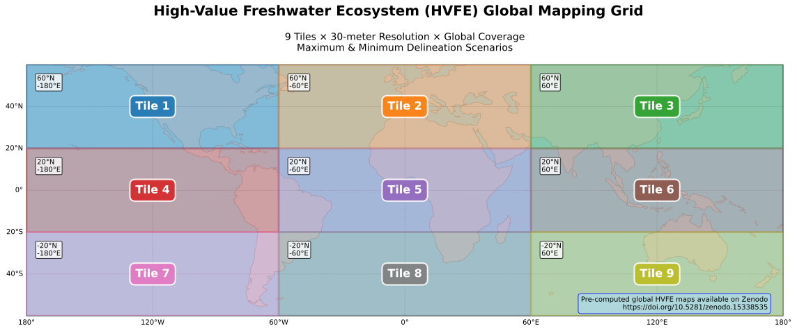

# Part 1: High-Value Freshwater Ecosystem (HVFE) Mapping

[](LICENSE)
[](https://www.python.org/downloads/)

This repository contains Python scripts for generating **High-Value Freshwater Ecosystem (HVFE) maps** at 30-meter resolution globally. The workflow processes geospatial data to identify and map critical freshwater ecosystems using multiple scenario-based delineation approaches.

## Data Availability

The **global HVFE maps**, delineated under both minimum and maximum scenarios at 30-meter resolution, are available on Zenodo: 

[](https://doi.org/10.5281/zenodo.15338535)

**CSV Outputs**: Country-level results for both the water (HVFE area) and carbon (CO₂ removal potential) components—used to generate figures and analyses in the related paper—are available in the `CSV files/` directory of this repository.

## Overview

The HVFE mapping system generates **9 global tiles** covering freshwater ecosystems worldwide. Each tile is processed independently using aligned geospatial datasets to ensure consistency and accuracy. The methodology supports both maximum and minimum delineation scenarios (with and without floodplain).

The HVFE mapping system divides the globe into 9 tiles for comprehensive coverage:



## Input Datasets

All input datasets are aligned to the **30-meter UMD Land Cover layer** for spatial consistency:

| Dataset | Resolution | Description |
|---------|------------|-------------|
| **UMD Land Cover** | 30m | Primary land cover classification layer |
| **MERIT Hydro Stream** | 90m → 30m | Stream network (downsampled and aligned) |
| **Slope** | 90m → 30m | Terrain slope (resampled and aligned) |
| **Catchments** | 30m | drived from downscaled MERIT stream and slope  |
| **GFplain** | 90m → 30m | Global Floodplain dataset (resampled and aligned) |

> 📋 **Note**: See the associated research paper for complete methodological details and data sources.

## Core Scripts

### Scenario Delineation Scripts

#### `maximum_delineation.py` & `minimum_delineation.py`
**Purpose**: Generate HVFE maps using maximum and minimum delineation scenarios

**Inputs**:
- UMD Land Cover layer
- Stream network layer
- Catchment boundaries
- GFplain (floodplain extent)

**Output**: 
- Tile-based HVFE maps in WGS84 projection
- Classified ecosystem types with scenario-specific extents

**Usage**:

**Requirements**: JupyterHub environment with computational resources

```python
# Load and run in JupyterHub notebook cell:
exec(open('GlobalHVFE_Max_delineation.py').read())
exec(open('GlobalHVFE_Min_delineation.py').read())
```

### Country-Level Analysis Scripts

#### `country_HVFE_max.py`
**Purpose**: Generate country-level HVFE statistics and maps

**Features**:
- Uses UN country boundaries for precise clipping
- Calculates area statistics for each HVFE class per country
- Handles proper reprojection for accurate area calculations
- Outputs results in hectares

**Inputs**:
- HVFE tile outputs (from delineation scripts)
- UN country shapefile (https://www.naturalearthdata.com/downloads/10m-cultural-vectors/10m-admin-0-countries/)

**Output**:
- Country-clipped HVFE maps
- Area statistics by HVFE class per country

#### `country_UMD.py`
**Purpose**: Analyze land cover composition within HVFE classes by country

**Features**:
- Intersects UMD land cover with HVFE classifications
- Calculates detailed land cover statistics per HVFE class
- User-configurable HVFE class selection
- Area calculations in hectares

**Example Configuration**:
```python
# Extract land cover stats for floodplain areas (class 6) under maximum scenario
target_hvfe_class = 6  # Floodplain from maximum delineation
```

## Part 2: Carbon Accumulation Potential Estimation

### Overview
The carbon accumulation potential analysis utilizes **Google Earth Engine (GEE)** JavaScript code to estimate carbon sequestration potential within HVFE classes. The analysis is implemented through two complementary scripts that handle different HVFE scenarios and classes.

### Google Earth Engine Scripts

#### `carbon_accumulation_scenario1.js`
**Purpose**: Calculate carbon accumulation potential for maximum scenario and class 5 in minimum scenario

**Target Classes**:
- **Maximum delineation scenario**: headwaters, stream buffers, water body buffers, geomorphic floodplains
- **Minimum delineation scenario**: Class 5 only

**Methodology**:
- Applies standard Cook-Patton et al. carbon accumulation rates
- Restricts analysis to forest biomes (RESOLVE 2017)
- Targets degraded areas (croplands and short vegetation) for restoration
- No tree cover threshold adjustments applied

**GEE Link**: [View in Google Earth Engine Code Editor](https://code.earthengine.google.com/42b6bfce8a73a2ccf216142cc4f2f702)

#### `carbon_accumulation_scenario2.js`
**Purpose**: Calculate carbon accumulation potential for classes 3-4 in minimum scenario with maximum tree cover thresholds

**Target Classes**:
- **Minimum delineation scenario**: Classes 3-4 (headwaters and low-order stream buffers)

**Methodology**:
- Applies Cook-Patton et al. carbon rates **multiplied by maximum optimal tree cover percentages**
- Uses Sprenkle-Hyppolite et al. tree cover thresholds for agricultural compatibility
- Designed to minimize impact on agricultural production
- Accounts for reduced but sustainable carbon sequestration in agricultural landscapes

**Rationale**: The separate script handles the specialized tree cover threshold methodology required for classes 3-4 in the minimum scenario, ensuring agricultural productivity is maintained while maximizing restoration potential.

**GEE Link**: [View in Google Earth Engine Code Editor](https://gcc02.safelinks.protection.outlook.com/?url=https%3A%2F%2Fcode.earthengine.google.com%2F55e9327ca883c5d7b495c30f9c449997&data=05%7C02%7Cmahyasadat.ghazizadehhashemi%40nasa.gov%7Cb664abc3e9734bc2c55908dd9a0af785%7C7005d45845be48ae8140d43da96dd17b%7C0%7C0%7C638836094146268997%7CUnknown%7CTWFpbGZsb3d8eyJFbXB0eU1hcGkiOnRydWUsIlYiOiIwLjAuMDAwMCIsIlAiOiJXaW4zMiIsIkFOIjoiTWFpbCIsIldUIjoyfQ%3D%3D%7C0%7C%7C%7C&sdata=YBJC%2Bn%2BuOm6scTStPH7A%2F%2Fyyk7DwUMzdE2eOfc4ZneY%3D&reserved=0)

### Carbon Analysis Methodology

#### Restoration Potential in HVFE-Adjacent Terrestrial Ecosystems
The carbon accumulation analysis focuses on **restoration potential within targeted HVFE areas** to avoid afforestation while maximizing carbon sequestration benefits. The methodology applies specific criteria:

**Geographic Targeting**:
- **Forest biomes only**: Uses RESOLVE 2017 vector dataset to restrict analysis to forest biomes
- **Selected HVFE classes**: 
  - Headwater regions
  - Fixed-width buffers around low-order streams  
  - Fixed-width buffers around surface water bodies and high-order streams
  - Geomorphic floodplains (maximum scenario only)
- **Degraded areas**: Targets croplands and short vegetation classes (Potapov et al.) for restoration

#### Carbon Removals from Restoration
**Carbon Accumulation Rates**:
- Based on Cook-Patton et al. global carbon accumulation rates from natural forest regeneration
- Uses 13,000+ field observations at ~1km² resolution
- Models first 30 years of aboveground carbon accumulation (Mg C ha⁻¹ yr⁻¹)

**Scenario-Specific Adjustments**:
- **Minimum scenario** (classes 3-4): Carbon rates multiplied by maximum optimal tree cover percentage in agricultural lands (Sprenkle-Hyppolite et al.)
- **Maximum scenario** and **minimum scenario class 5**: Standard carbon accumulation rates applied
- Tree cover thresholds derived from expert elicitation for 53 regional cropping and grazing systems

**Unit Conversions**:
- Pixel-level calculations: Mg C ha⁻¹ yr⁻¹ → Mg C pixel⁻¹ yr⁻¹
- Final reporting: Carbon values converted to CO₂ equivalent using molecular weight factor (44/12)

### Data Integration
The GEE scripts integrate the following datasets:
- **HVFE classification maps** (from Part 1)
- **RESOLVE 2017 biomes** (forest biome delineation)
- **Cook-Patton et al. carbon accumulation rates** (~1km resolution)
- **Potapov et al. land cover** (croplands and short vegetation)
- **Sprenkle-Hyppolite et al. tree cover thresholds** (agricultural compatibility)
- **Environmental variables** for carbon rate modeling

## Repository Structure
```
HVFE-Mapping/
├── python_scripts/
│   ├── maximum_delineation.py
│   ├── minimum_delineation.py
│   ├── country_HVFE_max.py
│   └── country_UMD.py
├── gee_scripts/
│   ├── carbon_accumulation_scenario1.js
│   └── carbon_accumulation_scenario2.js
└── README.md
```

## Workflow Integration
1. **HVFE Mapping** (Python): Generate HVFE classifications using maximum/minimum scenarios
2. **Country-Level HVEF Analysis** (Python): Generate HVFE in a country level with UMD distribution
3. **Biome Filtering** (GEE): Restrict analysis to forest biomes using RESOLVE 2017 dataset
4. **Restoration Area Identification** (GEE): Identify degraded areas (croplands/short vegetation) within target HVFE classes
5. **Carbon Accumulation Modeling** (GEE): Apply Cook-Patton et al. rates with scenario-specific adjustments
6. **Country-Level Aggregation** (GEE): Calculate national and global carbon removal potential
7. **Results Integration**: Combine HVFE extent with carbon accumulation estimates and convert to CO₂ equivalent

## Key References
- **Cook-Patton et al.**: Global carbon accumulation rates from natural forest regeneration
- **RESOLVE 2017**: Global biome classification for forest identification  
- **Potapov et al.**: Global land cover for degraded area identification
- **Sprenkle-Hyppolite et al.**: Maximum tree cover thresholds in agricultural systems

## Requirements
- **Python Environment**: JupyterHub with geospatial libraries
- **Google Earth Engine**: JavaScript API access
- **Data Access**: Zenodo datasets and GEE data catalog

---

**Keywords**: freshwater ecosystems, geospatial analysis, conservation mapping, MERIT Hydro, land cover analysis, carbon sequestration, biomass estimation, Google Earth Engine

